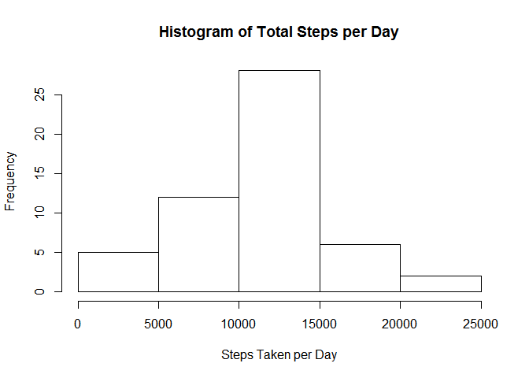
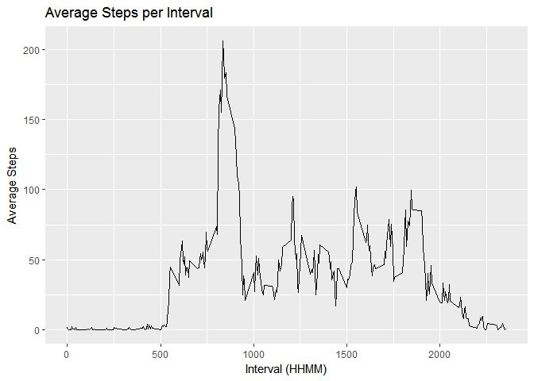
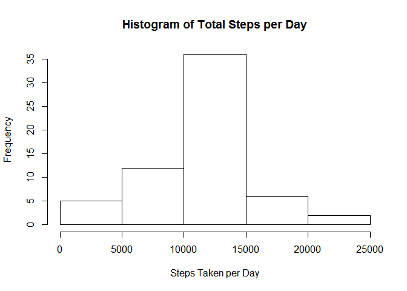
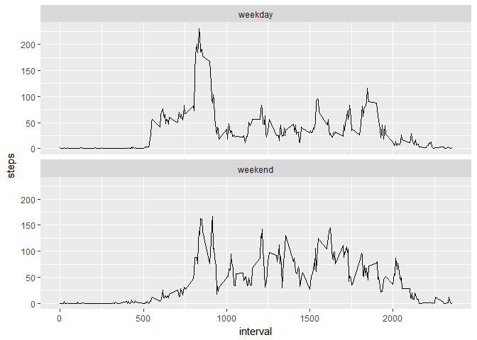

# Reproducible Research: Peer Assessment 1


## Loading and preprocessing the data


```r
unzip(zipfile = "activity.zip") # unpack the zip file
activitydata<-read.table(file="activity.csv",header=TRUE,sep=",")
activitydata$dt1<-strptime(activitydata$date,"%Y-%m-%d")
str(activitydata)
```

```
## 'data.frame':	17568 obs. of  4 variables:
##  $ steps   : int  NA NA NA NA NA NA NA NA NA NA ...
##  $ date    : Factor w/ 61 levels "2012-10-01","2012-10-02",..: 1 1 1 1 1 1 1 1 1 1 ...
##  $ interval: int  0 5 10 15 20 25 30 35 40 45 ...
##  $ dt1     : POSIXlt, format: "2012-10-01" "2012-10-01" ...
```


## What is mean total number of steps taken per day?

Calculate the total number of steps taken per day
   

```r
aggdata<-aggregate(steps~date,data=activitydata,sum)
```
    
     Make a histogram of the total number of steps taken each day
     

```r
hist(aggdata$steps,xlab="Steps Taken per Day"
     ,main="Histogram of Total Steps per Day")
```

<!-- -->
    
    Calculate and report the mean and median of the total number of steps taken
    per day
    

```r
print (c("Mean of the total steps taken per day = ",mean(aggdata$steps))
       ,quote=FALSE)
```

```
## [1] Mean of the total steps taken per day = 
## [2] 10766.1886792453
```

```r
print (c("Median of the total steps taken per day = ",median(aggdata$steps))
       ,quote=FALSE)
```

```
## [1] Median of the total steps taken per day = 
## [2] 10765
```


## What is the average daily activity pattern?
    Make a time series plot (i.e. type = "l") of the 5-minute interval (x-axis)
    and the average number of steps taken, averaged across all days (y-axis)


```r
library(ggplot2)
```

```
## Warning: package 'ggplot2' was built under R version 3.4.1
```

```r
agginterval<-aggregate(steps~interval,data=activitydata,mean)
qplot(interval,steps,data=agginterval,xlab="Interval (HHMM)",geom="line"
      ,main="Average Steps per Interval",ylab="Average Steps")
```

<!-- -->
    
    
    Which 5-minute interval, on average across all the days in the dataset, contains the maximum number of steps?
    

```r
maxavgsteps<-max(agginterval$steps)
intervalrec<-subset(agginterval,agginterval$steps==maxavgsteps)
intervalrec$interval[1]
```

```
## [1] 835
```


## Imputing missing values

 Calculate and report the total number of missing values in the dataset (i.e. the total number of rows with NAs)
    

```r
x<-subset(activitydata,is.na(steps))
print (c("The total number of rows with NAs = ",nrow(x)),quote=FALSE)
```

```
## [1] The total number of rows with NAs = 
## [2] 2304
```

    Create a new dataset that is equal to the original dataset but with the 
    missing data filled in.
    
    Imputed missing values using the mean for the 5-minute interval
    

```r
colnames(agginterval)<-c("interval","meansteps")

##append interval mean to each row of activitydata
adwmean<-merge(activitydata,agginterval)

## split data into two dataframe:  one with NAs and one without NAs
adwmeanNA<-subset(adwmean,is.na(steps))
adwmeannotNA<-subset(adwmean,!is.na(steps))

##replace NAs in dataframe with NAs with theinterval mean
adwmeanNA$steps<-adwmeanNA$meansteps

##combine dataframe with imputed NA values with the dataframe without NAs
ADimputed<-rbind(adwmeanNA,adwmeannotNA)
```

    Make a histogram of the total number of steps taken each day and Calculate 
    and report the mean and median total number of steps taken per day. 
    
   

```r
aggdataimp<-aggregate(steps~date,data=ADimputed,sum)
hist(aggdataimp$steps,xlab="Steps Taken per Day"
     ,main="Histogram of Total Steps per Day")
```

<!-- -->

```r
print (c("Mean of the total steps taken per day = ",mean(aggdataimp$steps))
       ,quote=FALSE)
```

```
## [1] Mean of the total steps taken per day = 
## [2] 10766.1886792453
```

```r
print (c("Median of the total steps taken per day = ",median(aggdataimp$steps))
       ,quote=FALSE)
```

```
## [1] Median of the total steps taken per day = 
## [2] 10766.1886792453
```
    
    Do these values differ from the estimates from the first part of the 
    assignment? What is the impact of imputing missing data on the estimates of
    the total daily number of steps?
    
       The Mean is the same and the Median increased slightly to equal the mean.

## Are there differences in activity patterns between weekdays and weekends?

    Create a new factor variable in the dataset with two levels – “weekday” and 
    “weekend” indicating whether a given date is a weekday or weekend day.
    

```r
##  create a dataframe of weekdays and the day type = "weekday" or "Weekend"
wdays<-data.frame(wkday=c("Mon","Tue","Wed","Thu","Fri","Sat","Sun")
        ,daytype=c("weekday","weekday","weekday","weekday","weekday","weekend"
        ,"weekend"))

## append a column identifying the abbreviated weekday to the imputed data
ADimputed$wkday<-weekdays(ADimputed$dt1,abbreviate=TRUE)

## Append daytype column to the imputed data based on the abbreviated weekday
ADimputedwDT<-merge(ADimputed,wdays)
```
  
    Make a panel plot containing a time series plot (i.e. type = "l") of the 
    5-minute interval (x-axis) and the average number of steps taken, averaged 
    across all weekday days or weekend days (y-axis).
    

```r
dtp<-aggregate(steps~interval + daytype, data=ADimputedwDT,mean)
 g<-ggplot(dtp,aes(interval,steps))
 g + geom_line() + facet_wrap(~daytype,nrow=2,ncol=1)
```

<!-- -->
